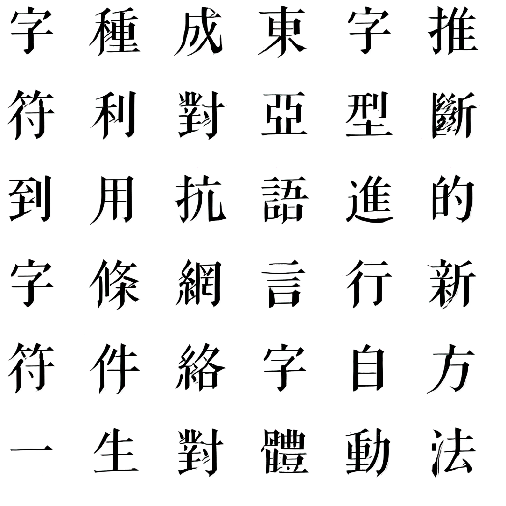
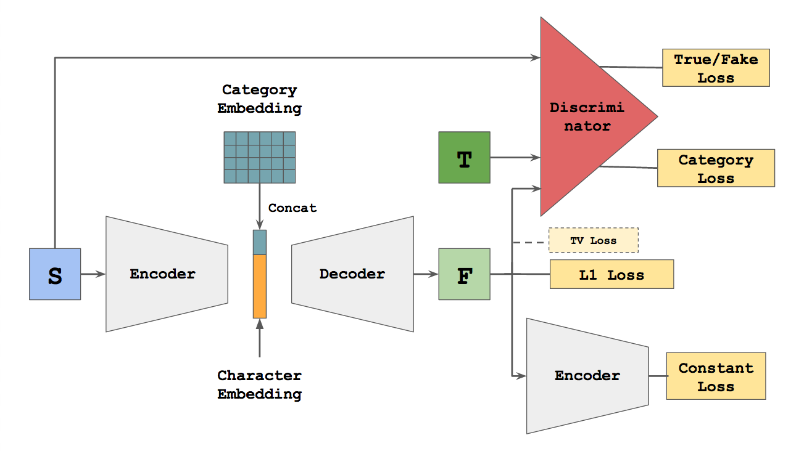
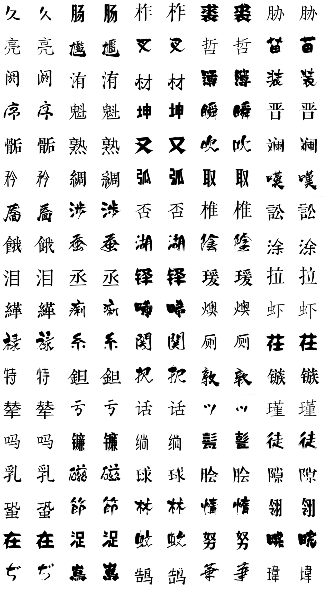
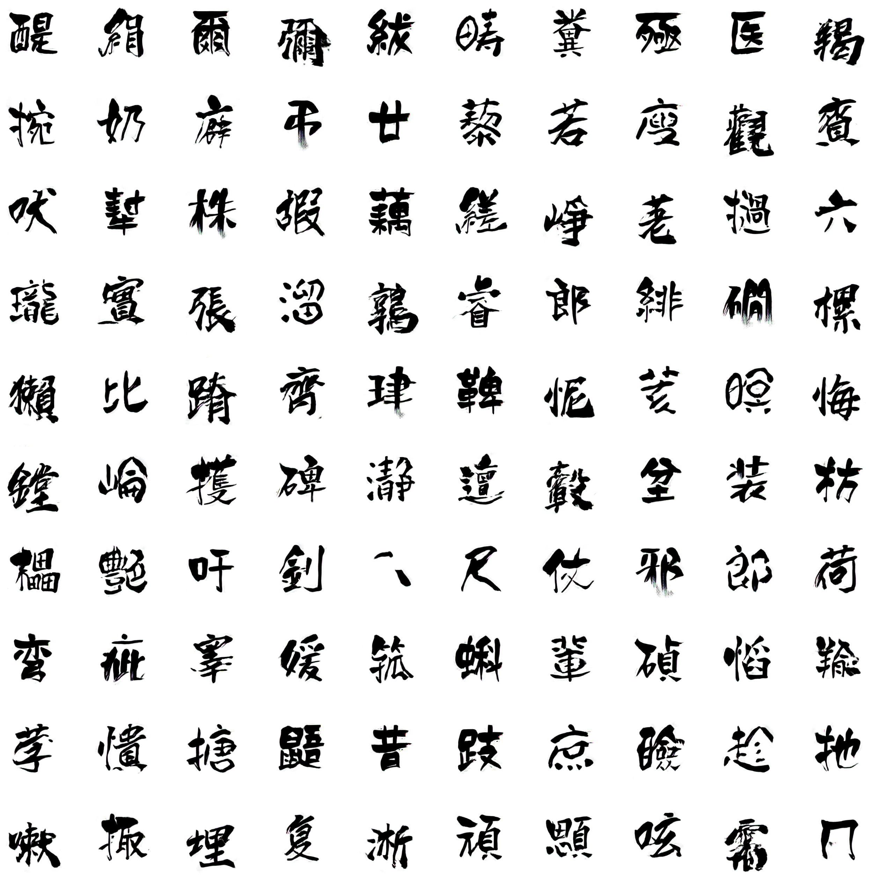
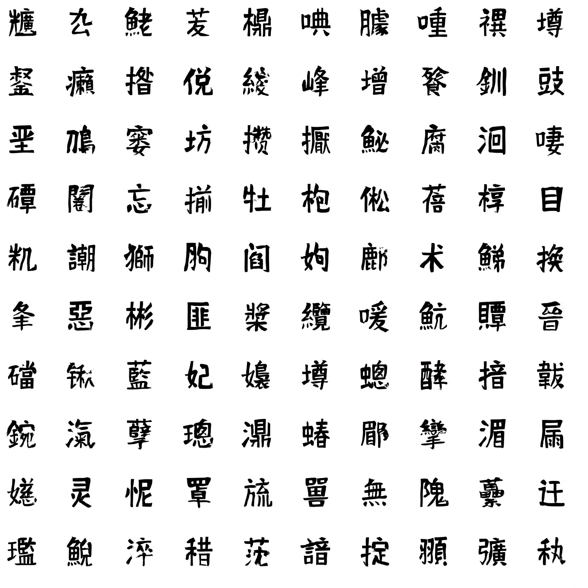
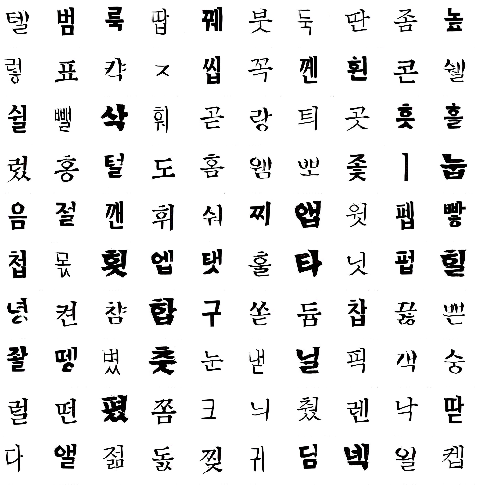
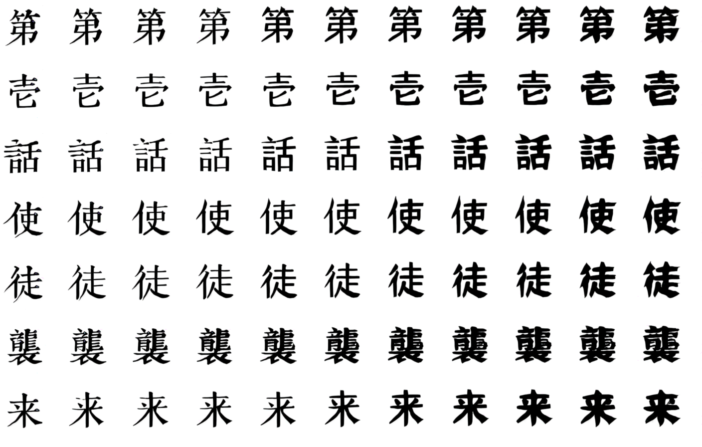
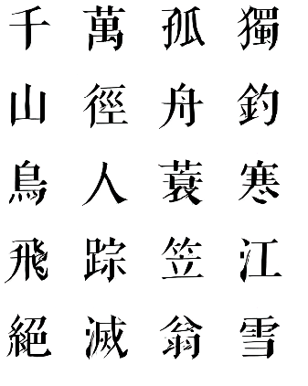
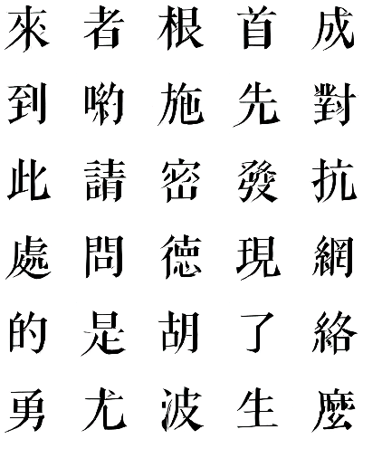

# zi2zi: Learning Easter Asian character style with GAN

  

## Introduction
Learning eastern asian language typeface with GAN. zi2zi(字到字, meaning from character to character) is an application and extension of the recent popular [pix2pix](https://github.com/phillipi/pix2pix) model to Chinese characters.

Details could be found in [**this**]() blog post.

## Network Structure

The network structure is based off pix2pix with the addition of category embedding and two other losses, category loss and constant loss, from [AC-GAN](https://arxiv.org/abs/1610.09585) and [DTN](https://arxiv.org/abs/1611.02200) respectively.

## Gallery
### Ground Truth Comparison

### Brush Writing Fonts

### Random Gaussian Style

### Korean

### Interpolation

### Animation

  

  

  

## How to Use
### Step Zero
Download tons of fonts as you please
### Requirement
* Python 2.7
* CUDA
* cudnn
* Tensorflow >= 1.0.1
* Pillow(PIL)
* numpy >= 1.12.1
* scipy >= 0.18.1
* imageio

### Preprocess
The avoid IO bottleneck, preprocessing is necessary to pickle your data into binary then persist in memory during training.
### Experiment Layout
### Train
### Infer and Interpolate
### Pretrained Model
## Acknowledgements
Code derived and rehashed from:

* [pix2pix-tensorflow](https://github.com/yenchenlin/pix2pix-tensorflow) by [yenchenlin](https://github.com/yenchenlin)
* [Domain Transfer Network](https://github.com/yunjey/domain-transfer-network) by [yunjey](https://github.com/yunjey)
* [ac-gan](https://github.com/buriburisuri/ac-gan) by [buriburisuri](https://github.com/buriburisuri)
* [dc-gan](https://github.com/carpedm20/DCGAN-tensorflow) by [carpedm20](https://github.com/carpedm20)
* [origianl pix2pix torch code](https://github.com/phillipi/pix2pix) by [phillipi](https://github.com/phillipi)

## License
Apache 2.0